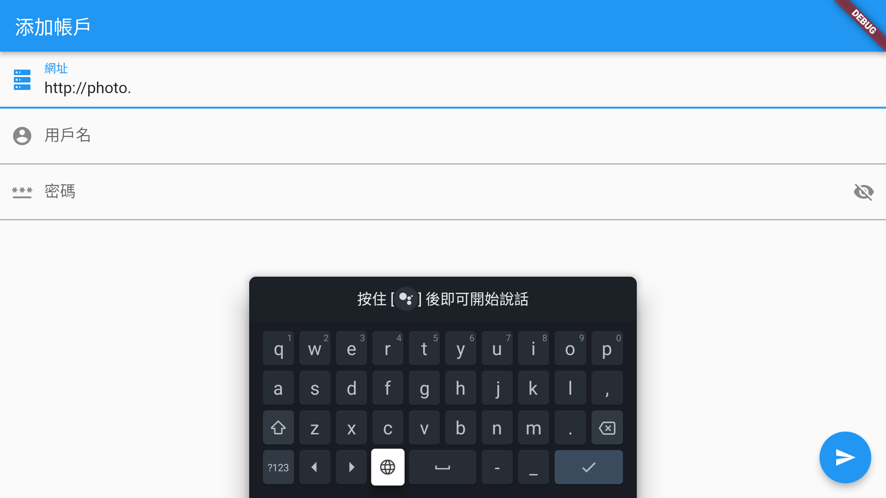
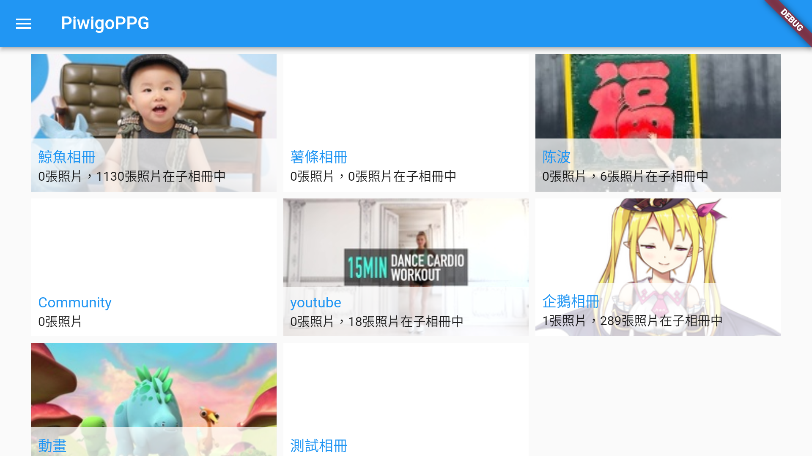
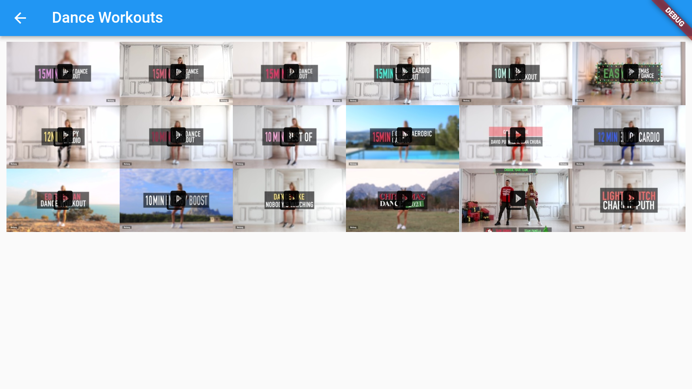

# piwigo

This is a third-party client of piwigo, the main purpose is to support android
tv, so that the photos/videos on piwigo can be played on my living room TV

# sign in

The first step after opening the app is to enter your piwigo server address,
username and password：

tv is not very easy to type but don't worry, the program will remember this
information after the first input, and it will automatically sign in next time.

# Play photos and videos

Once the login is successful, you can use the remote control arrow keys to
select the content to play, use the remote control ok key to confirm the cancel
key to cancel.

# Play Shortcut

When playing a photo or video in full screen, use the left and right keys on the
remote control to play the previous or next photo/video.

Use the up button on the remote control to switch the autoplay function. If you
turn on autoplay, the next content will be played automatically after the video
is played. The default setting for photos is to play the next content
automatically after 5 seconds.

Use the ok key to turn on the controller, it's useless for tv that plays photos,
for videos you can pause and fast forward or rewind after turning on the
controller. Use the cancel key to close the controller.

# Modify server information

There is a menu bar in the upper left corner of the home page, where 'Manage
Accounts' can modify server information or switch users.

After selecting a user, use the ok key to switch to using this user to access
the server, use the left button to delete the user information, and use the
right button to edit the user information.
